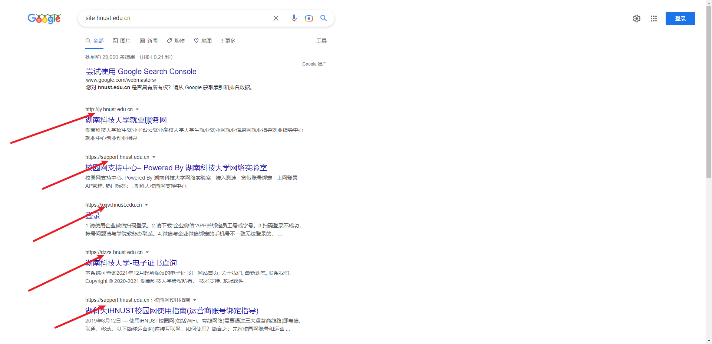
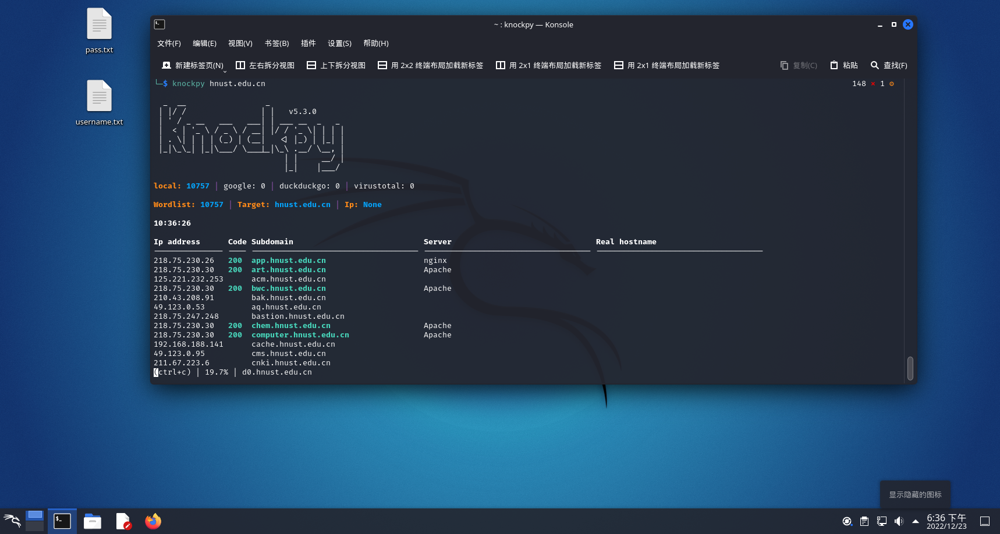

# 信息搜集

## Whois信息

### What

whois（读作“Who is”，非缩写）是用来查询[域名](https://baike.baidu.com/item/域名/86062?fromModule=lemma_inlink)的IP以及[所有者](https://baike.baidu.com/item/所有者/2193463?fromModule=lemma_inlink)等信息的[传输协议](https://baike.baidu.com/item/传输协议/8048821?fromModule=lemma_inlink)。简单说，whois就是一个用来查询[域名](https://baike.baidu.com/item/域名/86062?fromModule=lemma_inlink)是否已经被注册，以及注册域名的详细信息的数据库（如域名所有人、[域名注册](https://baike.baidu.com/item/域名注册?fromModule=lemma_inlink)商）。通过whois来实现对[域名](https://baike.baidu.com/item/域名/86062?fromModule=lemma_inlink)信息的查询。早期的whois查询多以命令列接口存在，但是现在出现了一些网页接口简化的线上查询工具，可以一次向不同的数据库查询。网页接口的查询工具仍然依赖whois协议向服务器发送查询请求，命令列接口的工具仍然被[系统管理员](https://baike.baidu.com/item/系统管理员/1503845?fromModule=lemma_inlink)广泛使用。whois通常使用[TCP](https://baike.baidu.com/item/TCP/33012?fromModule=lemma_inlink)协议43端口。每个[域名](https://baike.baidu.com/item/域名/86062?fromModule=lemma_inlink)/IP的whois信息由对应的管理机构保存。

### Why

在进行安全测试时，WHOIS信息可以用来帮助确定网站的所有者以及网站是否已过期。这有助于确定网站是否可能存在安全漏洞（如果过期说明维护者不再维护该网站所以漏洞可能较多），并且可以帮助测试人员联系网站所有者以获取更多信息或协助解决问题。

此外，WHOIS信息还可以用于发现假冒网站。有时候，攻击者会创建类似于真实网站的假冒网站来诈骗用户的信息。通过查询WHOIS信息，可以找出假冒网站的所有者并进行调查。 

总的来说重点看联系人信息，网站的注册日期、到期日期，如果网站的WHOIS信息显示其所有者是未知的或不可信的，则可能意味着该网站存在欺诈性行为，并可能存在安全风险。

得到域名注册人的信息，对他进行·钓鱼，生成针对性的字典。(测试登录界面会用到与社工库连用)

社会工程学

### How

https://whois.chinaz.com/

需要小心的网站

​                                                                                                                                                                                                                                                                                                                                                                                                                                                                                                                                                                                                                                                                                                                             

https://sg.godaddy.com/

需要小心的网站（特别是这种带外国的号码）

查国外whois

https://lookup.icann.org/

https://www.whois.com/

## 子域名

### What

是在[域名系统](https://baike.baidu.com/item/域名系统?fromModule=lemma_inlink)等级中，属于更高一层域的域。比如，mail.example.com和calendar.example.com是example.com的两个子域，而example.com则是[顶级域](https://baike.baidu.com/item/顶级域?fromModule=lemma_inlink)[.com](https://baike.baidu.com/item/.com?fromModule=lemma_inlink)的子域。

### Why

相对主站，分站的安全防范会弱一些，因此通过收集子域名信息进行渗透是目前常见的一种手法。

### How

1. 通过google hack语法进行寻找

例如：site:hnust.edu.cn

2、knockpy 检测子域名漏洞并且爆破子域名

Knockpy是一个基于python3的子域名挖掘安全工具，可通过字典攻击快速[枚举](https://so.csdn.net/so/search?q=枚举&spm=1001.2101.3001.7020)目标域上的子域名。扫描DNS区域传输，并尝试绕过通配DNS记录。再最新版本中knockpy支持查询VirusTotal子域，您可以在config.json文件中设置API_KEY。

knockpy hnust.edu.cn  

